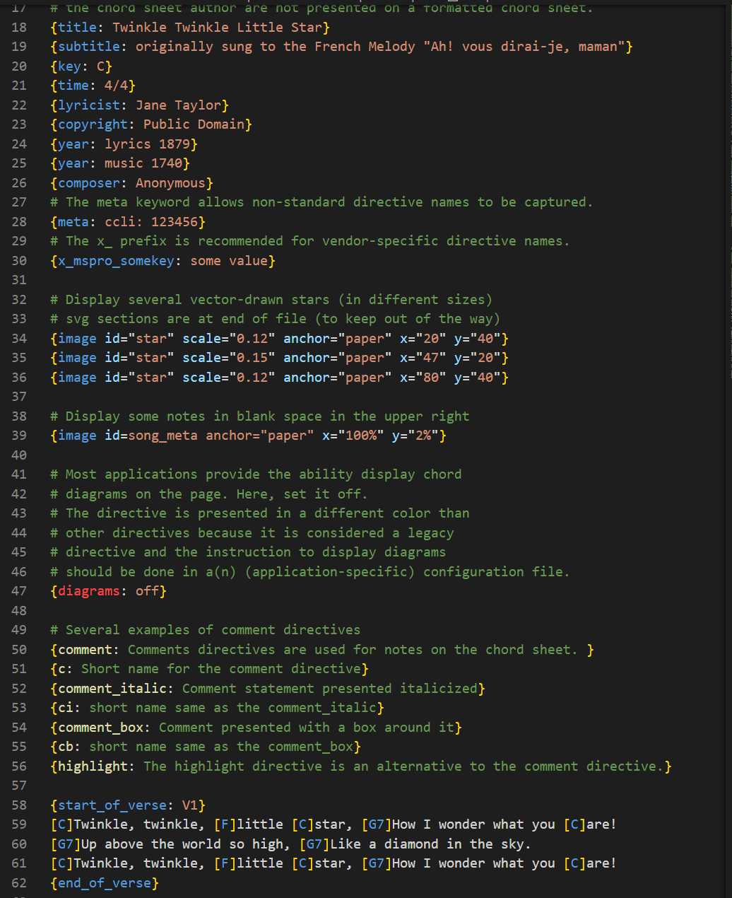
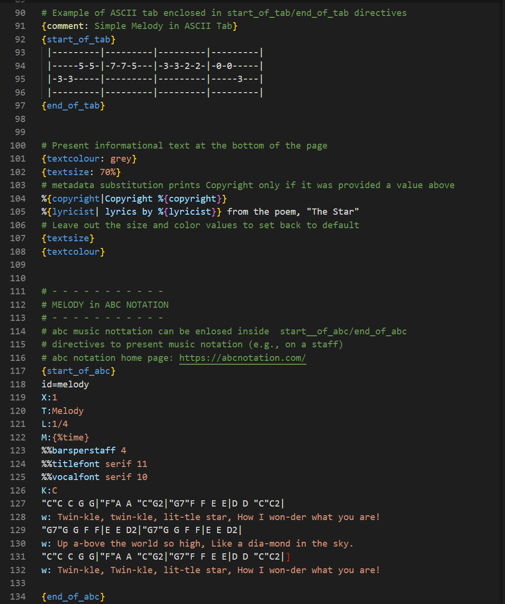
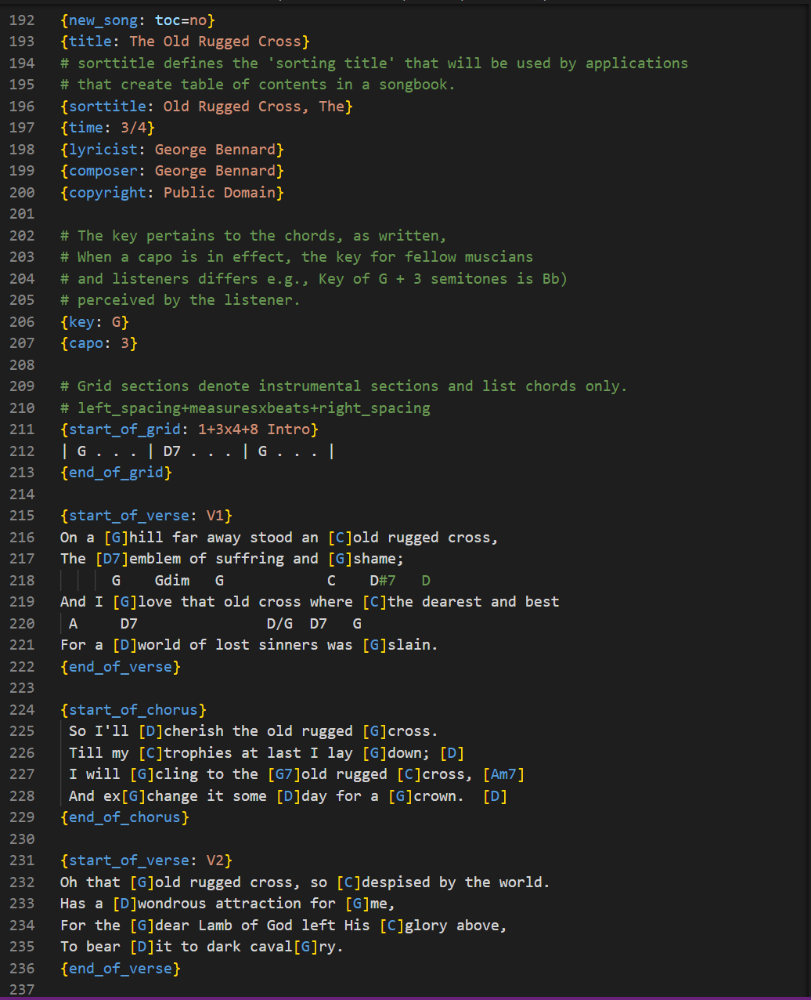
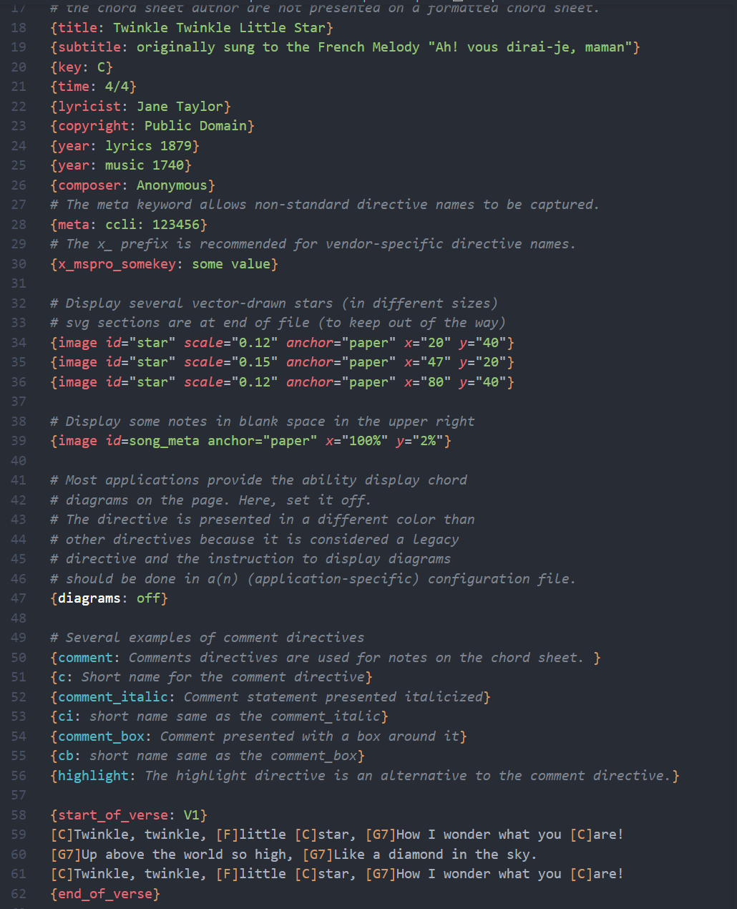
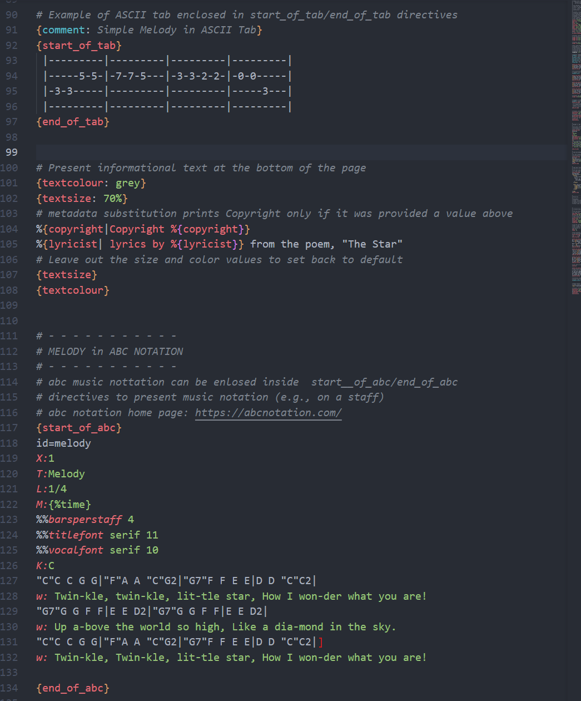
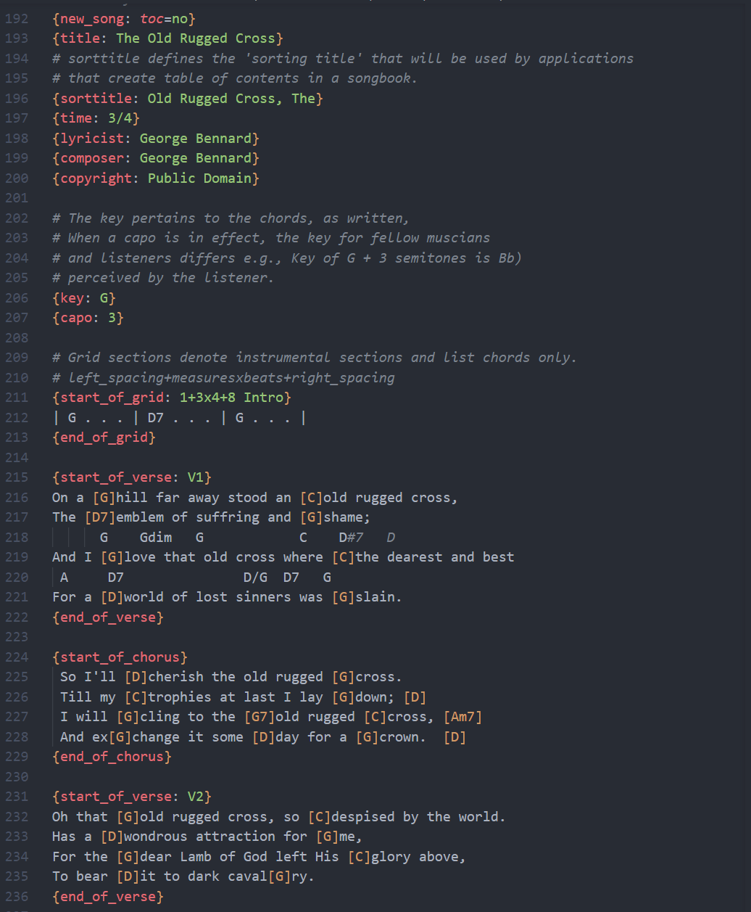
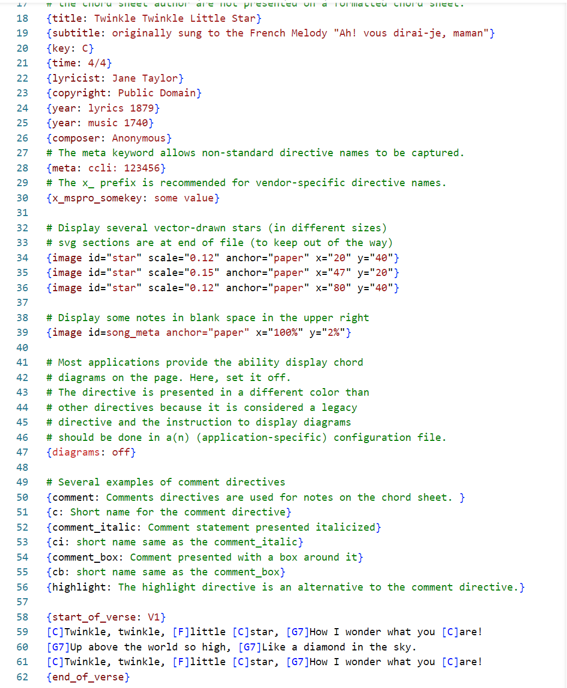
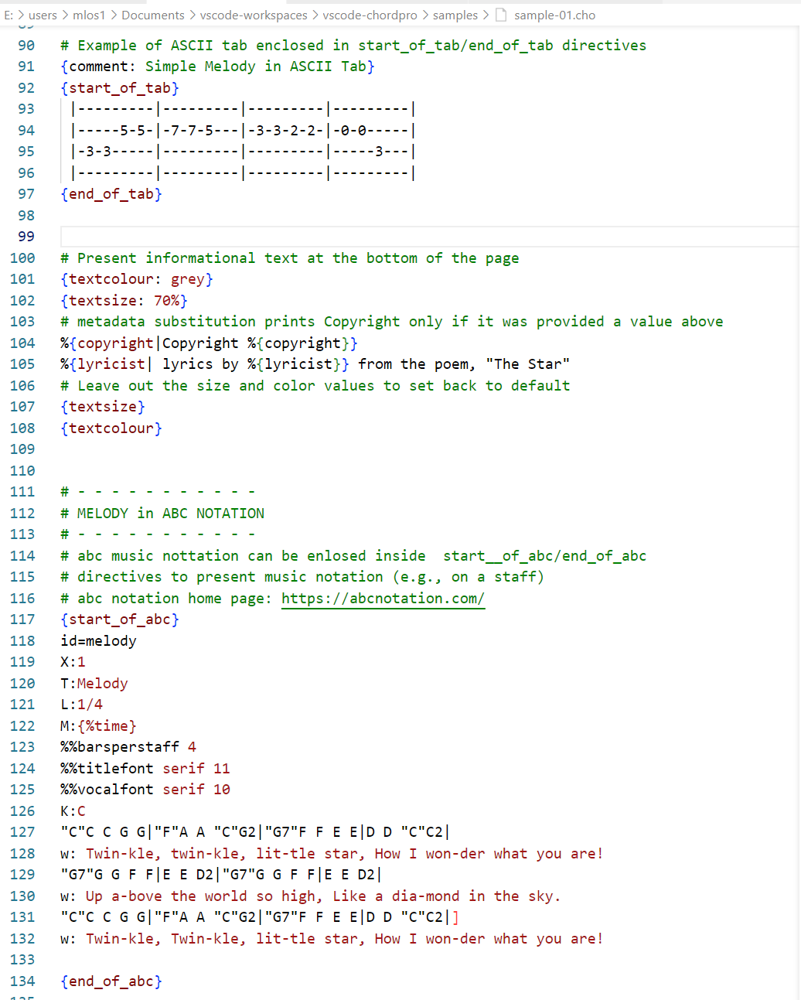
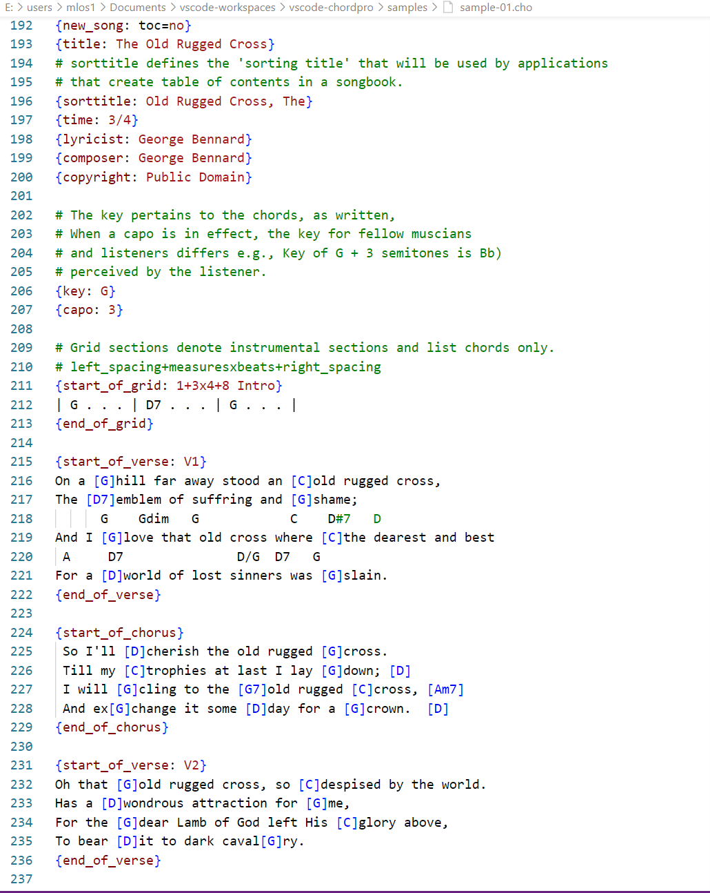

# Visual Studio Code ChordPro Syntax Highligting Extension

This extension provides syntax highlighting within Microsoft Visual Studio Code for ChordPro v6.

The [ChordPro](https://www.chordpro.org/) format is a  text-based markup language for representing chord charts by describing the position of chords in relation to the song's lyrics (i.e., where they belong in the song), song sections, and song metadata (i.e., information about the song).

Although human-readable, this format is intended to be provided as input to a computer
program that transforms it into PDF, HTML, or display on the screen.

There are many programs that provide some level of support for ChordPro. See the 
[Supporting Software](#Supporting-Software) for some examples.

File extensions used for this format include '.cho', `.crd`, `.chopro`, `.pro`, or
`.chordpro`. [[wiki](https://en.wikipedia.org/wiki/ChordPro)]

## Features

- Syntax highlighting
   - chords on lyric lines
   - standard and custom directives
      - legacy directives are highlighted in a different color
   - directive values (key-value pairs, character sequences)
   - metadata substitution expressions
   - Pango markup tags
   - line comments
   - partial support for [[abc notation](https://abcnotation.com/)] parameter lines
- Snippets for entering comment directives and common song sections
   - verse, chorus, bridge, tab, and grid directives
   - comment, comment_italic, and comment_box directives
   - guitar, 4 string bass, and ukulele tab
- Content within environment directives (i.e., start_of_../end_of_..) is foldable

## Screenshot Examples
The color used for different items (e.g., directive tags, comments, etc) is determined by the active color theme. Example screen shots from two dark themes and one light theme can be selected from the table below.

| Color Theme | Examples |
|-------------|----------|
| Dark+ | &nbsp;&nbsp;  &nbsp;&nbsp;  |
| One Dark Pro  |   &nbsp;&nbsp;  &nbsp;&nbsp;  |
| Visual Studio Light  |   &nbsp;&nbsp;  &nbsp;&nbsp;  |

## Requirements

None (other than Visual Studio Code).

## Extension Settings

None.

## Known Issues

- Syntax highlighting of meta directives whose value contains a metadata substitution is not always correct.
- The syntactic recognition of Pango markup is simplistic and any content enclosed in '<' and '/>' will be highlighted as markup elements. On a positive note, elements within an SVG section will be highlighted.
- Any text at the beginning of a line preceded by '%%' is highlighted as an abc notation parameter.

## Release Notes

See the [CHANGELOG](CHANGELOG.md) file.

## Related Software
The following list presents examples of programs and web sites that support the ChordPro format. This is not an exhaustive list and is in no particular order

* [ChordPro Perl Implementation](https://github.com/ChordPro/chordpro)
   * Reference implementation of the ChordPro standard for musical lead sheets.
   * Windows, Linux, Docker
   * Open Source, Artistic License 2.0
* [MobileSheets](https://zubersoft.com/mobilesheets/)
   - Mobile app that enables display, organization, and collaboration of sheet music (including chord sheets).
   * iPadOS, Android, Windows
   * Commercial
* [Music Stand by Worship Tools](https://www.worshiptools.com/en-us/music-stand)
   * WorshipTools creates powerful, free, volunteer friendly software tools designed for churches and worship teams.
   * Web, Android, iOS
   * Subscription-based service, free account available
[* Worsihp Together](https://worshiptogether.com)
   * Songs can be downloaded in ChordPro format
   * Subscription-based service, free account available
* [OnSong](https://onsongapp.com/)
   - Allows musicians to store, sort, customize and perform your music unlike any other app.
   * macOS 11.0+, iOS 15.0+, iPadOS 15.0+
   * https://onsongapp.com/docs/features/formats/chordpro/
   * Subscription-based service
* [ricardomfmsousa/vscode-chordpro](https://github.com/ricardomfmsousa/vscode-chordpro)
   * Syntax Highlighting Extension for Microsoft Visual Studio Code
   * Open Source, MIT License

## License

This extension is licensed under the [MIT License](LICENSE.txt).
